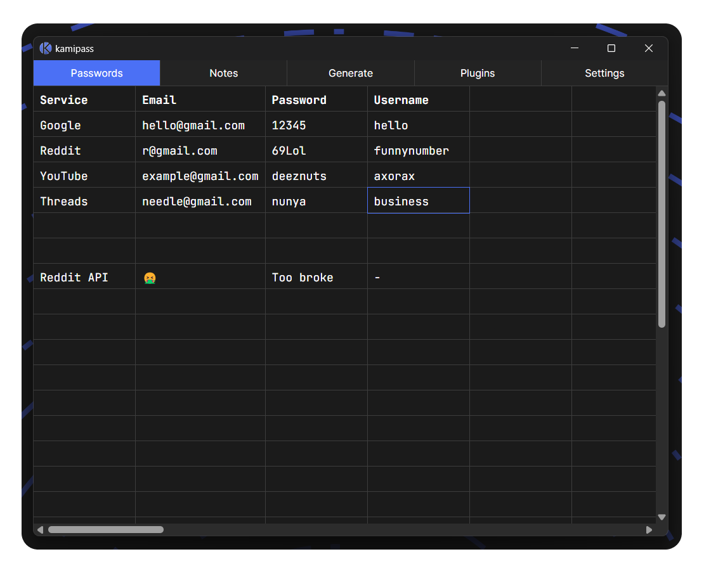

Kamipass

Secure minimal password manager

# ❓ About

Kamipass is a minimal and secure password manager. It has some simple note taking abilities built-in with encryption, spreadsheet like password management and QR code and password generation. Kamipass also supports plugins that can be made and used by anyone in the community. There are shortcuts to make it easier to navigate and do work faster. Everything is encrypted. All you need to know is the master password (that you set yourself).

If you want to create a plugin for Kamipass, checkout the [wiki page](https://github.com/Axorax/kamipass/wiki).

# 🪟 App Preview

---

<a href="https://www.patreon.com/axorax">Support me on Patreon</a> — <a href="https://github.com/axorax/socials">Check out my socials</a>
